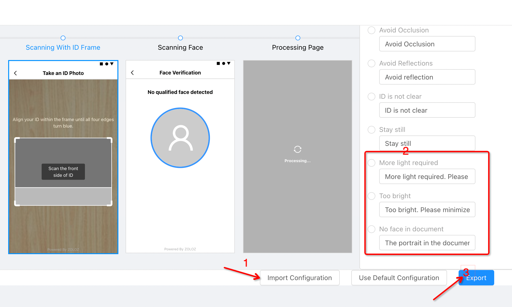

# Change Log
All notable changes, such as SDK releases, updates and fixes, are documented in this file.

+ note: when you update new version, you also need to check the latest proguard file 
+ https://docs.zoloz.com/zoloz/saas/integration/neug2p#G6ZlO

## Version 2.1.1.251229142921
## Version 2.1.0.251217170122
## Version 2.0.9.251125163451
+ When you upgrade to 2.0.0 later version, you need to read carefully about this notice
+  https://docs.zoloz.com/zoloz/saas/maintenance/w-lbpzxt
+ there ars some  changes about integration the SDK
+ refer to  https://docs.zoloz.com/zoloz/saas/releasenotes/
+ this version，for easier customer integration, we have merged the libc++_shared.so library into the zolozcore package.
+ you don't need to integrated the libc++_shared.so again.
## Version 2.0.8.251113151316
+ When you upgrade to 2.0.0 later version, you need to read carefully about this notice
+  https://docs.zoloz.com/zoloz/saas/maintenance/w-lbpzxt
+ there ars some  changes about integration the SDK
+ refer to  https://docs.zoloz.com/zoloz/saas/releasenotes/
+ this version，for easier customer integration, we have merged the libc++_shared.so library into the zolozcore package.
+ you don't need to integrated the libc++_shared.so again.
## Version 2.0.7.251029113342
+ When you upgrade to 2.0.0 later version, you need to read carefully about this notice
+  https://docs.zoloz.com/zoloz/saas/maintenance/w-lbpzxt
+ there ars some  changes about integration the SDK
+ refer to  https://docs.zoloz.com/zoloz/saas/releasenotes/
+ this version，for easier customer integration, we have merged the libc++_shared.so library into the zolozcore package.
+ you don't need to integrated the libc++_shared.so again.

## Version 2.0.6.251009104745
+ When you upgrade to 2.0.0 later version, you need to read carefully about this notice
+  https://docs.zoloz.com/zoloz/saas/maintenance/w-lbpzxt
+ there ars some  changes about integration the SDK
+ refer to  https://docs.zoloz.com/zoloz/saas/releasenotes/
+ this version，for easier customer integration, we have merged the libc++_shared.so library into the zolozcore package.
+ you don't need to integrated the libc++_shared.so again.

## Version 2.0.5.250916100104
+ When you upgrade to 2.0.0 later version, you need to read carefully about this notice
+  https://docs.zoloz.com/zoloz/saas/maintenance/w-lbpzxt
+ there ars some  changes about integration the SDK
+ refer to  https://docs.zoloz.com/zoloz/saas/releasenotes/
+ this version，for easier customer integration, we have merged the libc++_shared.so library into the zolozcore package.
+ you don't need to integrated the libc++_shared.so again.

## Version 2.0.4.250825152718
+ When you upgrade to 2.0.0 later version, you need to read carefully about this notice
+  https://docs.zoloz.com/zoloz/saas/maintenance/w-lbpzxt
+ there ars some  changes about integration the SDK
+ refer to  https://docs.zoloz.com/zoloz/saas/releasenotes/
+ this version，for easier customer integration, we have merged the libc++_shared.so library into the zolozcore package.
+ you don't need to integrated the libc++_shared.so again.

## Version 2.0.3.250811111422
+ When you upgrade to 2.0.0 later version, you need to read carefully about this notice
+ https://docs.zoloz.com/zoloz/saas/maintenance/w-lbpzxt
+ there ars some  changes about integration the SDK
+ refer to  https://docs.zoloz.com/zoloz/saas/releasenotes/
+

## Version 2.0.2.250724111229
+ When you upgrade to 2.0.0 later version, you need to read carefully about this notice
+ https://docs.zoloz.com/zoloz/saas/maintenance/w-lbpzxt
+ there ars some  changes about integration the SDK
+ refer to  https://docs.zoloz.com/zoloz/saas/releasenotes/
+ 
## Version 2.0.1.250715140231
+ **above this version, this SDK can support Android 16KB pageSize**
+ When you upgrade to 2.0.0 later version, you need to read carefully about this notice
+ https://docs.zoloz.com/zoloz/saas/maintenance/w-lbpzxt
+ there ars some changes about integration the SDK
+ refer to  https://docs.zoloz.com/zoloz/saas/releasenotes/

## Version 2.0.0.250624102841
+ When you upgrade to 2.0.0 later version, you need to read carefully about this notice
+ there ars some changes about integration the SDK
+ https://docs.zoloz.com/zoloz/saas/maintenance/w-lbpzxt
+ Specific changes:
+ Add libc++_shared.so in the src/main/libs directory.
+ Add configuration settings in the build.gradle file under the app directory.
  ```
  sourceSets {
    main {
     jniLibs.srcDirs = ['src/main/libs']
    }
   }
  ```
+ refer to  https://docs.zoloz.com/zoloz/saas/releasenotes/


## Version 1.5.6.250610163507
+ refer to  https://docs.zoloz.com/zoloz/saas/releasenotes/

## Version 1.5.5.250519101845
+ refer to  https://docs.zoloz.com/zoloz/saas/releasenotes/

## Version 1.5.4.250430113339
+ refer to  https://docs.zoloz.com/zoloz/saas/releasenotes/


## Version 1.5.3.250415165302
+ refer to  https://docs.zoloz.com/zoloz/saas/releasenotes/


## Version 1.5.2.250328102654
+ refer to  https://docs.zoloz.com/zoloz/saas/releasenotes/

## Version 1.5.1.250221170434
+ refer to  https://docs.zoloz.com/zoloz/saas/releasenotes/a087-zlq#JMDD9

## Version 1.5.0.250114155639
+ refer to  https://docs.zoloz.com/zoloz/saas/releasenotes/bzitr7el#ubCdW

## Version 1.4.9.250106110026
+ refer to  https://docs.zoloz.com/zoloz/saas/releasenotes/xalv_6vz#IZjZO

## Version 1.4.8.241216154318
+ refer to  https://docs.zoloz.com/zoloz/saas/releasenotes/juvgoelg#UdIfy

## Version 1.4.7.241202192124
+ refer to  https://docs.zoloz.com/zoloz/saas/releasenotes/o-swbkmo#R8RGM

## Version 1.4.6.241114114940
+ refer to  https://docs.zoloz.com/zoloz/saas/releasenotes/yny3lcwj#Z46vY

## Version 1.4.5.240925162606
+ refer to  https://docs.zoloz.com/zoloz/saas/releasenotes/ynxuckag#hzPGQ

## Version 1.4.4.240904145406
**Note** : This version integrates Nearx into ZolozKit. 
+ If you have previously utilized the features of Nearx,
+ when upgrading to this version, you need to remove the line of implementation for Nearx
+ Otherwise, there will be a class conflict
+ refer to  https://docs.zoloz.com/zoloz/saas/releasenotes/ii81yc8j#C3l2Y

## Version 1.4.3.240814151616
+ refer to  https://docs.zoloz.com/zoloz/saas/releasenotes/

## Version 1.4.2.240710110801
+ refer to  https://docs.zoloz.com/zoloz/saas/releasenotes/ipwf9m-h#C3l2Y

## Version 1.4.2.240628152408
+ refer to  https://docs.zoloz.com/zoloz/saas/releasenotes/ekyc-saas-updates-20240705#XMR41

## Version 1.4.1.240604171116
+ refer to  https://docs.zoloz.com/zoloz/saas/releasenotes/ekyc-saas-updates-20240606#XMR41

## Version 1.4.0.240520142748
+ refer to  https://docs.zoloz.com/zoloz/saas/releasenotes/ekyc-saas-updates-20240522#XMR41

## Version 1.3.7.240326103427
+ Fix some bugs.
+ refer to  https://docs.zoloz.com/zoloz/saas/releasenotes/ekyc-saas-updates-20240411#XMR41

## Version 1.3.7.240319135852
+ Fix some bugs.
+ refer to  https://docs.zoloz.com/zoloz/saas/releasenotes/

## Version 1.3.6.240223182256
+ refer to  https://docs.zoloz.com/zoloz/saas/releasenotes/ekyc-saas-updates-20240301#XMR41

## Version  1.3.5.240102094458
+ refer to  https://docs.zoloz.com/zoloz/saas/releasenotes/ekyc-saas-updates-20240104#Ai48R


## Version  1.3.4.231205171033
+ refer to  https://docs.zoloz.com/zoloz/saas/releasenotes/ekyc-saas-updates-20231208#8JBXT


## Version 1.3.3.231103135532
+ Added a new operation guide diagram in the NativeSDK scanning page for Real ID and ID Recognition. Users will be prompted to center their ID within the capture box, for both the front and back sides of the document.
  **Notice:**
   We will not update this changeLog later, Refer to this link about the SDK release note detail : https://docs.zoloz.com/zoloz/saas/releasenotes/
+ refer to https://docs.zoloz.com/zoloz/saas/releasenotes/ekyc-saas-updates-20231103#IZj88

## Version 1.3.2.231020100216
+ Improve identification document prompt experience

**Notice:**
If you are upgrading from an older version, you need to configure the newly added text In the Portal's UI Configuration page.

If the configuration for the newly added texts, namely "zdoc_msg_too_dark", "zdoc_msg_too_bright", and "zdoc_msg_abrasion", is not available,
the corresponding English texts will be displayed by default. This may cause inconsistency with the set language.
I would recommend re-importing from In the Portal's UI Configuration page and configuring these new texts. Once you have made the necessary configurations, you can export the file again.

## Version 1.3.1.230925144644
+ Fix some bugs.
+ Improve face detection capabilities
+ Add new feature for doc detection by NFC

## Version 1.3.0.230907171559
+ Fix some bugs.

**Notice:**

If other SDKs are integrated at the same time, and you run into issue "More than one file was found with OS independent path 'lib/arm64-v8a/libc++_shared.so'".
The main reason is that the ZOLOZ SDK and other SDKs add the libc++_shared.so library. The solution is to add the following configuration in the build.gradle.

```groovy
  packagingOptions {
    pickFirst 'lib/arm64-v8a/libc++_shared.so'
    pickFirst 'lib/armeabi-v7a/libc++_shared.so'
  }
```

## Version 1.2.17.230721110219
+ Fix some bugs.

## Version 1.2.16.230625174717
+ Fix some bugs.

## Version 1.2.15.230522102749
+ Fix some bugs.

## Version 1.2.14.230511093806
+ Fix some bugs.

## Version 1.2.13.230404102843
+ Fix some bugs.

## Version 1.2.12.230322103026
+ Fix some bugs.

## Version 1.2.11.230224141004
+ Add text to the face capture interface as it supports displaying multiple paragraphs of custom content.
+ Fix some bugs.

## Version 1.2.10.230112141843
+ Fix face retry data issues

## Version 1.2.9.221014103813
+ Fix some bugs.

## Deprecated
## Version 1.2.9.221008144313
+ Fix some bugs.
+ Improve ui config capabilities

## Deprecated
## Version 1.2.8.220817145238
+ Accessibility Support

## Deprecated
## Version 1.2.7.220715155219
+ Improve face detection capabilities

## Deprecated
## Version 1.2.6.220705114203
+ Fix device id issues

## Version 1.2.6.220616153250
+ Improve face detection capabilities


## Version 1.2.5.220513101757
+ Improve face detection capabilities

## Version 1.2.4.220419103223
+ Improve face detection capabilities

## Version 1.2.3.220328142726

+ Fix compatibility issues on some devices

## Version 1.2.3.220215114217

+ Improve face detection capabilities

## Version 1.2.2

+ fix the conflict class for MPaaS.

## Version 1.2.1

+ Improve flash detection capabilities
+ Improve camera focus capabilities
+ Improve the reverse side of documents detection capabilities
+ Improve occlusion detection capabilities

## Version 1.2.0

+ Support multi face detection
+ Improve occlusion detection capabilities

## Version 1.1.0

+ Improve SDK security.
+ Fixed the camera focus issue on old Samsung devices.

## Version 1.0.3

+ Fixed webview config.

## Version 1.0.2

+ Fixed UI Configuration bugs.

## Version 1.0.0

+ First release ZOLOZ sdk for RealId/Connect product.